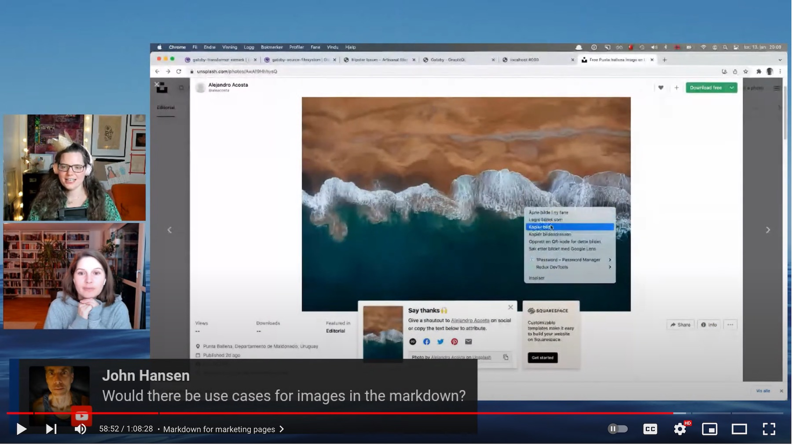

I showed you a neat little trick in Friday's email: referencing a markdown file from the front matter of another markdown file.

While live coding it on last week's [unauthorized and rum-fueled treasure hunt](https://youtu.be/Wipi2lw6Mvc?t=3412), John asked an (as always) excellent question:

> Would there be a use case for images in the markdown?

[](https://youtu.be/Wipi2lw6Mvc?t=3412 "Screengrab of John's question overlayed on the screen and Mirjam and I searching for an image on Unsplash")

**Yes absolutely.**

Common use-cases would be page-specific open graph images, feature images for an article, or as in our case, an image per page section.

```md
---
sections:
  - title: About us
    md: ./about.md
    img:
      file: ./founder.jpg
      alt: Image of the founder holding a laptop
---
```

To get "magical" access to the image referenced, make sure to add both `gatsby-plugin-sharp` and `gatsby-transformer-sharp`. These plugins will transform all image files sourced by the `gatsby-source-filesystem` into `ImageSharp` content nodes.

You'll find the referenced image under `childImageSharp`. The same way referenced markdown files are available as `childMarkdownRemark`.

```
query ExampleQuery {
  markdownRemark {
    frontmatter {
      sections {
        title
        img {
          file {
            childImageSharp {
              gatsbyImageData
            }
          }
          alt
        }
        md {
          childMarkdownRemark {
            html
          }
        }
      }
    }
  }
}
```

&nbsp;  
Do you know if references to other types of files work the same way?  
Please let me know if you do!

&nbsp;  
All the best,  
Queen Raae

&nbsp;  
**PS:** Today's Live Screencast got postponed. I had forgotten my mother's Alzheimer's appointment; luckily, she had not. There's a joke in there somewhere 🤪
