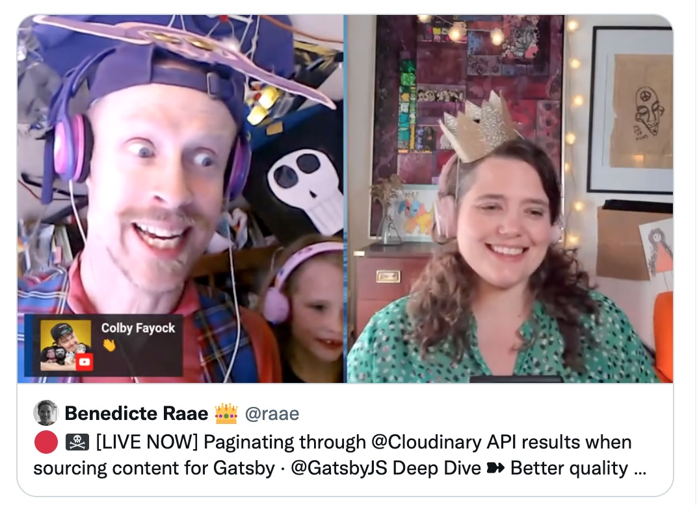

We covered the two ways to paginate through API results when sourcing data on yesterday's [unauthorized and rum-fueled treasure hunt](https://youtu.be/y2oIg8xvWC0) in the sharky waters around the Gatsby islands.

[](https://youtu.be/y2oIg8xvWC0)

## The What?

Get more than the first page of results from an external API.

In our case, that means more than the "max results" returned from each request to the resources endpoint of the Cloudinary API.

## The Why?

Pagination is needed to solve the bug [Only returns up to 500 results](https://github.com/cloudinary-devs/gatsby-source-cloudinary/issues/5) in gatsby-source-cloudinary.

And it's on us to fix it as Cloudinary has hired us to make sure their Gatsby Plugins are up-to-date by summer 🎉🎉🎉

## The How

There are two fundamental ways for solving pagination: recursion and iteration.

Both solve the use case "if there are more results, ask the API for the next page of results".

To not repeatedly ask for the same page, the API needs to know something about the requested page.

It can be the index of the page you are requesting, as seen in the ConvertKit [subscribers endpoint](https://developers.convertkit.com/#list-subscribers).

Or it can be the concept of a cursor as used by Cloudinary. If there are more possible resources than included in the response, Cloudinary adds a next cursor value you then need to provide to the subsequent request for resources.

### Recursion

Recursion is when a function calls itself within its code. It's a great way to get the same code to execute again and again and again.

But you must also make sure you stop at some point, or you'll continue to infinity and beyond (yes, I did just rewatch Toy Story with the Pirate Princess).


In our case, we only let `createCloudinaryNodes` call itself if there is a next cursor present in the response coming from Cloudinary.

```js
// gatsby-node.js
// ... import and configure cloudinary
const createCloudinaryNodes = async (gatsbyUtils, nextCursor) => {
  const result = await cloudinary.api.resources({
    resource_type: "image",
    next_cursor: nextCursor,
  });

  gatsbyUtils.reporter.info(
    `Fetched Cloudinary Assets >>> ${result.resources.length} from ${nextCursor}`
  );

  // ... create a node for each resource in result.resource

  if (result.next_cursor) {
    await createCloudinaryNodes(gatsbyUtils, result.next_cursor);
  }
};

exports.sourceNodes = async (gatsbyUtils) => {
  await createCloudinaryNodes(gatsbyUtils);
};
```

### Iteration

For the iterative solution, we used a do...while loop. The code in the do part of do...while loop will always execute once. And then keep on executing as long as the while condition is true.

In our case, we will keep requesting a new page of resources from Cloudinary until Cloudinary does not respond with the next cursor.

```js
// gatsby-node.js
// ... import and configure cloudinary
const createCloudinaryNodes = async (gatsbyUtils) => {
  let nextCursor = null;

  do {
    const result = await cloudinary.api.resources({
      resource_type: "image",
      next_cursor: nextCursor,
    });

    gatsbyUtils.reporter.info(
      `Fetched Cloudinary Assets >>> ${result.resources.length} from ${nextCursor}`
    );

    // ... create a node for each resource in result.resource

    nextCursor = result.next_cursor;
  } while (nextCursor);
};

exports.sourceNodes = async (gatsbyUtils) => {
  await createCloudinaryNodes(gatsbyUtils);
};
```

## More code!

To see the "missing" code check out and how to limit the number of resources fetched, check out [the demo code on GitHub](https://github.com/queen-raae/gatsby-demo-api-pagination).

- [Pagination using recursion](https://github.com/queen-raae/gatsby-demo-api-pagination/pull/1)
- [Pagination using iteration](https://github.com/queen-raae/gatsby-demo-api-pagination/pull/2)

&nbsp;  
All the best,  
Queen Raae

**PS:** Use the approach you feel most comfortable with. Don't get hung up on tech-bros arguing one over the other!
