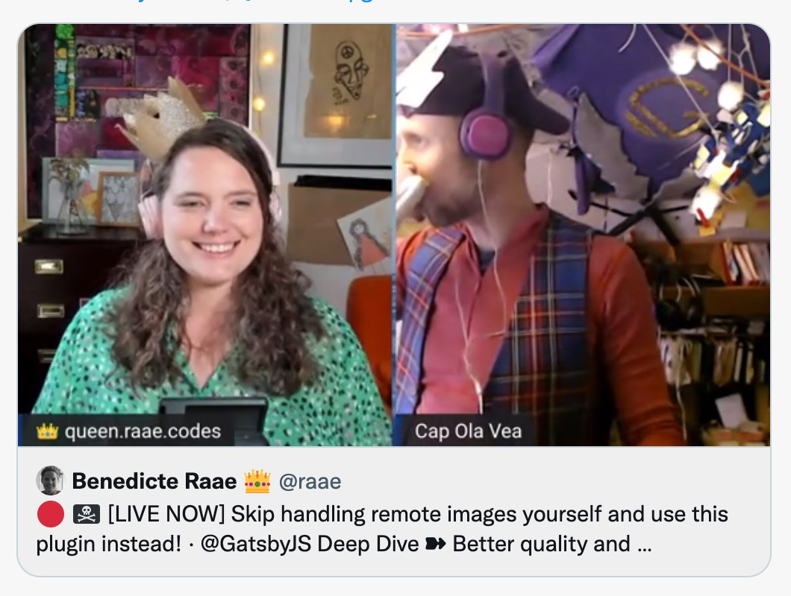

On yesterday's [unauthorized and rum-fueled treasure hunt](https://youtu.be/QB1Y8dWZpgM) in the sharky waters around the Gatsby islands, we played around with remote images again.

[](https://youtu.be/QB1Y8dWZpgM)

You get a genuinely atomic build by sourcing remote images into your Gatsby Data Layer as File nodes. Pointing to a URL you do not control on the world wide web is not a super robust solution.

## The What?

Make use of [gatsby-plugin-remote-images](https://github.com/graysonhicks/gatsby-plugin-remote-images) by [Grayson Hicks](https://twitter.com/graysonhicks), Staff Software Engineer at Gatsby in our web-scraping ScrapingBee demo.

Or, more broadly, utilizing the Gatsby Plugin Ecosystem.

## The Why?

So we do not have to go through the motions of creating remote file nodes ourselves!

Or, more broadly, let's not do it all in one plugin. Many plugins, for instance, create remote filed nodes, then realize the need to add an option to disable such functionality. Maybe the images should rather be uploaded to Cloudinary... Offloading the functionality to gatsby-plugin-remote-images such an option is no longer needed.

## The How

Install the plugin:

```sh
yarn add gatsby-plugin-remote-images
```

and add it to your Gatsby configuration:

```js
module.exports = {
  plugins: [
    {
      resolve: `gatsby-plugin-remote-images`,
      options: {
        nodeType: "CrowdcastWebinar",
        imagePath: "coverSrc",
        name: "cover",
      },
    },
  ],
};
```

This will create a file node for the remote image found at `coverSrc` on a `CrowdcastWebinar` node and make it available on `cover`.

Take a look at yesterday's [Pull Request](https://github.com/queen-raae/gatsby-demo-web-scraping/pull/5/files) for the complete picture.

&nbsp;

There are some nifty options if the structure of your nodes is not as straightforward as for `CrowdcastWebinar`. Check out the [gatsby-plugin-remote-images docs](https://github.com/graysonhicks/gatsby-plugin-remote-images) for those and more.

If you would like to use the file with the Gatsby Image component, make sure you follow the [gatsby-plugin-image instructions](https://www.gatsbyjs.com/plugins/gatsby-plugin-image) as well.

&nbsp;  
All the best,  
Queen Raae

**PS:** Next week, Grayson joins us to work on [GatsbyImageCDN](https://github.com/graysonhicks/gatsby-plugin-remote-images/issues/87) support 🎉
