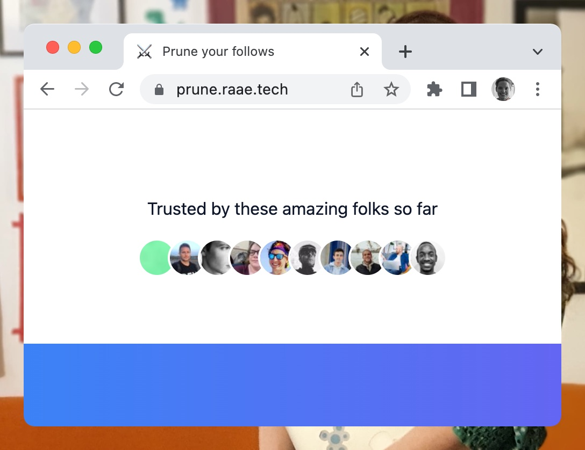

On yesterday's [unauthorized and rum-fueled treasure hunt](https://youtu.be/EK74ACNxM7M) in the sharky waters around the Gatsby islands, we refactored the little avatar section on [Prune your follows](https://prune.raae.tech) from client-side to server-side rendering!

[](https://youtu.be/EK74ACNxM7M)

PR: If you did (or do) watch the show, you'll see that I have sneakily done some cleaning up and solved our little environment variable problem by making sure I load them in the gatsby-config 🤦‍♀️ 🤪

## The What?

Source data from the avatars table on build, so that the little avatars are present as part of the statically generated version of the marketing page.

## The Why?

It gets rid of the tiny flicker of no content, and why call Supabase every time someone lands on the marketing page for [Prune your follows](https://prune.raae.tech) when there is no need? You can also use your service key when sourcing, allowing you to even information from otherwise locked down table rows.

[](https://prune.raae.tech)

## The How

- Fetch data on avatars using the Supabase SKD this time
- Create a Gatsby node for each avatar using `createNode`, `createNodeId` and `createContentDigest`.

## The Code

```js
// File: gatsby-node.js
// Note: Error handling omitted

const { createClient } = require("@supabase/supabase-js");

const supabaseUrl = process.env.GATSBY_PUBLIC_SUPABASE_URL;
const supabaseServiceKey = process.env.SUPABASE_SERVICE_KEY;

const serviceSupabase = createClient(supabaseUrl, supabaseServiceKey);

exports.sourceNodes = async (gatsbyUtils) => {
  const { actions, createNodeId, createContentDigest, reporter } = gatsbyUtils;
  const { createNode } = actions;

  const { data } = await serviceSupabase
    .from("avatars")
    .select("username, avatar_url")
    .limit(20);

  data.forEach((item) => {
    createNode({
      id: createNodeId(item.username),
      avatarUrl: item.avatar_url,
      username: item.username,
      internal: {
        type: "UserAvatar",
        contentDigest: createContentDigest(item),
      },
    });
  });
};
```

And voila, we have avatar nodes in the data layer we may use in the `Avatars` component:

```jsx
// File: Avatars.js
// Note: Styling omitted

import React from "react";
import { useStaticQuery, graphql } from "gatsby";

export function Avatars() {
  const data = useStaticQuery(graphql`
    query {
      allUserAvatar {
        nodes {
          username
          avatarUrl
        }
      }
    }
  `);

  return (
    <div>
      {data.allUserAvatar.nodes.map((user) => {
        return (
          
        );
      })}
    </div>
  );
}
```

To see the entire app code, check out its [GitHub repository](https://github.com/queen-raae/prune-your-follows).

&nbsp;  
All the best,  
Queen Raae
