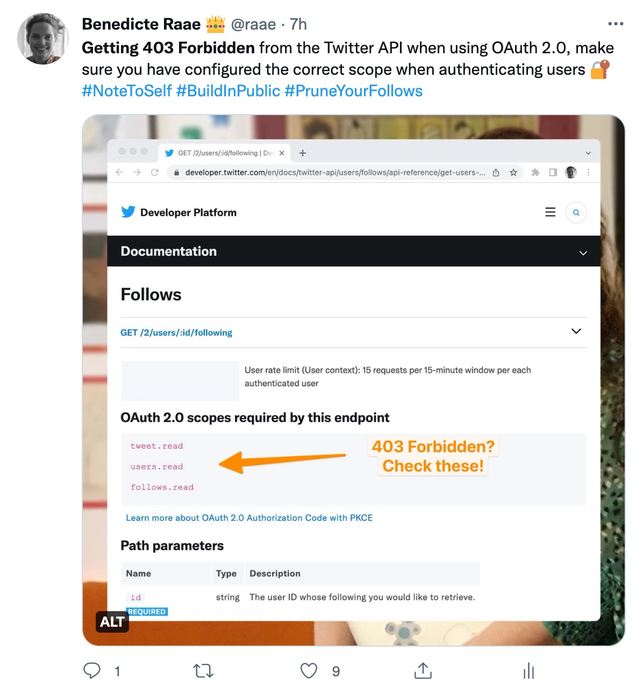

Today I spent some time not understanding why my request to Twitter was failing. It replied with `403 Forbidden`, but I was pretty confident the `accessToken` was correct. What could it be? I double, tripled checked my code.

Then I turned to my frenemy Google and found the answer way down there in an old forum thread. I had probably not requested the correct scope when authenticating the user.

As always, the information is right there in plain sight in [the documentation](https://developer.twitter.com/en/docs/twitter-api/users/follows/api-reference/get-users-id-following)&nbsp;🤦‍♀️

[](https://twitter.com/raae/status/1582323947961401344)

However, I set [up the NextAuth with Gatsby integration weeks ago](/emails/2022-09-09-nextauth/), and their default scope settings have worked perfectly so far 😱

To override NextAuth's default scope `authorization.params.scope` to your `TwitterProvider` configurations.

```js
export const authConfig = {
  // Configure one or more authentication providers
  providers: [
    TwitterProvider({
      clientId: process.env.TWITTER_CLIENT_ID,
      clientSecret: process.env.TWITTER_CLIENT_SECRET,
      version: "2.0",
      // 👇👇👇
      authorization: {
        params: {
          scope: "users.read tweet.read follows.read",
        },
      },
    }),
  ],
};
```

I hope you remember this when you need it or find it again when you need it. I'll probably google and land back on this myself the next time this happens to me 🤪

&nbsp;

All the best,  
Queen Raae
