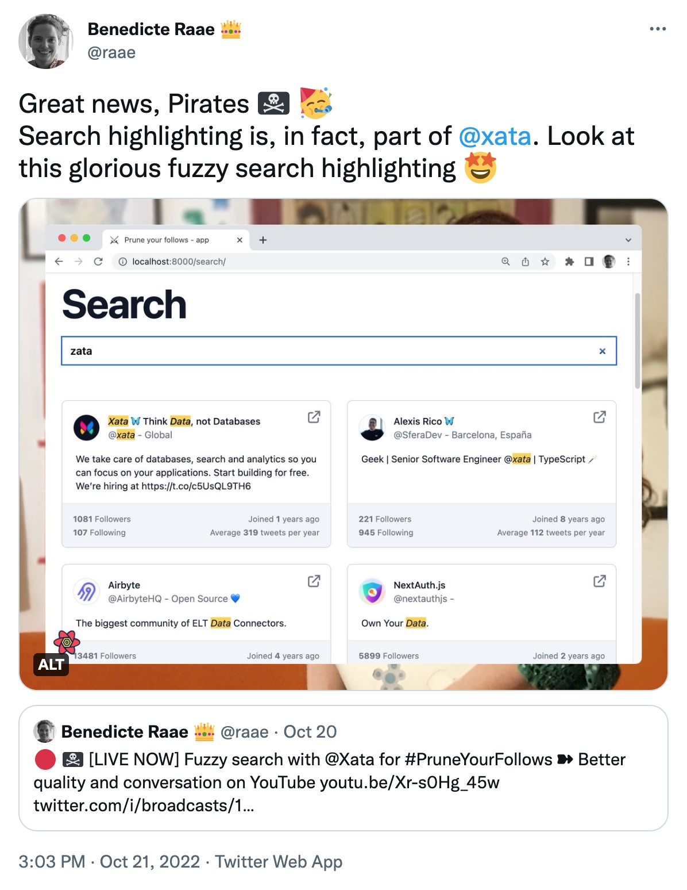

This week we explored search for "Prune your follows" on the [unauthorized and rum-fueled treasure hunt](https://youtu.be/yDxF8FUNUbI) in the sharky waters around the Gatsby islands 🏴‍☠️

[Xata](https://xata.io/) has search built-in. Even fuzzy search! Something that makes a dyslectic like me very happy.

Fuzzy search allows spelling errors by setting a fuzziness level.

<aside class="notice">

**Fuzziness Level:** Maximum [Levenshtein distance](https://en.wikipedia.org/wiki/Levenshtein_distance) for the search terms. The Levenshtein distance is the number of one-character changes needed to make two strings equal. The default is 1, meaning that single-character typos per word are tolerated by search. You can set it to 0 to remove the typo tolerance or set it to 2 to allow two typos in a word.  
<cite>Xata docs.</cite>

</aside>

On stream, we didn't manage to highlight the matches. We did think it was probably possible. And we were right! A Xata engineer reached out after the stream and told us how 🥳

[](https://twitter.com/raae/status/1583443888169025538)

## The Code

```js
// Function user in server-side code,
// in our case by a Gatsby Serverless Function

export const searchFollowing = async ({ followerId, sort, search }) => {
  const results = await xata.search.all(search, {
    tables: [
      {
        table: "accounts",
        target: [
          { column: "name", weight: 7 },
          { column: "username", weight: 7 },
          { column: "meta.location" },
          { column: "meta.description" },
        ],
        filter: { followed_by: followerId },
      },
    ],
    highlight: { enabled: true },
    fuzziness: 1,
    prefix: "phrase",
  });

  return results.map((result) => {
    return {
      ...result,
      searchInfo: result.record.getMetadata(),
    };
  });
};
```

Results returned from the above function 👇

```json
// Removed surplus properties for brevity
[
  {
    "table": "accounts",
    "record": {
      "name": "Xata 🦋 Think Data, not Databases",
      "username": "xata",
      "followed_by": "4092141"
    },
    "searchInfo": {
      "highlight": {
        "followed_by": ["<em>4092141</em>"],
        "name": ["<em>Xata</em> 🦋 Think <em>Data</em>, not Databases"],
        "username": ["<em>xata</em>"]
      },
      "score": 40.357788,
      "table": "accounts",
      "version": 15
    }
  },
  {
    // And more results
  }
]
```

And we can use the highlight property to create highlighted results.

For the complete code, check out the [Prune your Follows repository on Github](https://github.com/queen-raae/prune-your-follows/pull/19).

&nbsp;

All the best,  
Queen Raae

&nbsp;

**PS:** Xata is sponsoring our rework of Prune your Follows
