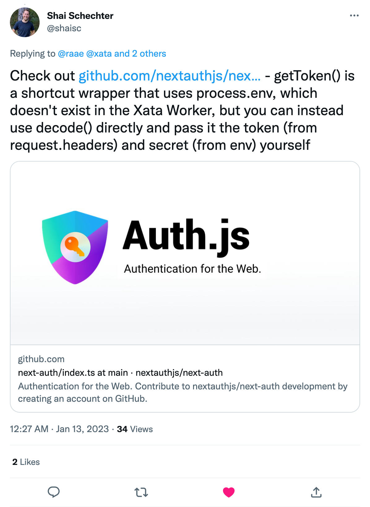

As soon as Prune your Follows facilitates 500 unfollows in 24 hours, it gets blocked by Twitter for 24 hours.

To combat this, we think that some type of queuing architecture is needed. Feel free to reply if you have any input!

So we decided to explore Xata Workers on this week's [unauthorized and rum-fueled treasure hunt](https://youtu.be/O89C_yxZK3o) as Xata Workers is built on top of [Cloudflare Workers](https://developers.cloudflare.com/workers) and Cloudflare also has [Cloudflare Queues](https://developers.cloudflare.com/queues/) 🤔

[](https://youtu.be/O89C_yxZK3o)

To my surprise [we did get a Worker working](https://youtu.be/O89C_yxZK3o?t=1558) locally while on stream 🥳

However, we did not handle authenticating the user inside our Xata Worker. Needed to make sure the user has access and only gets relevant records.

Pirate Shai to the rescue; hopefully, time will tell...

[](https://twitter.com/shaisc/status/1613679030494023682)

## The How

0. We initialized Xata Workers in our exiting Xata project `xata workers init`,
1. defined a Xata Worker, copy/past-ing the code from our Gatsby Function,
2. and then used the defined Worker directly in our `useQuery` replacing the GET request to `/api/account`

The Xata CLI will magically cut out the Xata Worker code and deploy it to Cloudflare for us, using `xata upload` 🤯

For local development, we used `xata workers watch`. Not completly sure what happens then 😬

```jsx
import { useQuery } from "@tanstack/react-query";
import { useUser } from "../user";

import { xataWorker } from "./../../xata";

// Define Xata Worker 1️⃣
const searchAccount = xataWorker(
  "searchAccount",
  async ({ xata }, { search }) => {
    const searchResults = await xata.search.all(search, {
      tables: [
        {
          table: "accounts",
          target: [
            { column: "name", weight: 3 },
            { column: "username", weight: 7 },
            { column: "meta.location" },
            { column: "meta.description" },
          ],
        },
      ],
      highlight: { enabled: true },
      fuzziness: 1,
      prefix: "phrase",
    });

    const records = searchResults.map((result) => {
      return {
        ...result,
        searchInfo: result.record.getMetadata(),
      };
    });

    return { records };
  }
);

export default function useSearch({ search }) {
  const { data: user } = useUser();

  return useQuery(
    ["accounts", user?.id, "search", search],
    async () => {
      // Use the Xata Worker 2️⃣
      return searchAccount({ search: search });
    },
    {
      enabled: Boolean(user?.enableQueries) && Boolean(search),
      keepPreviousData: true,
    }
  );
}
```

As mentioned, this code is incomplete, as we need to filter the accounts by the authenticated user.

Sign up for an [email reminder](/emails/reminders/) to ensure you catch the next stream, where we'll try to make that happen.

&nbsp;

All the best,\
Queen Raae

PS: Follow the [Pull Request](https://github.com/queen-raae/prune-your-follows/pull/74) if you are very interested 🤪
