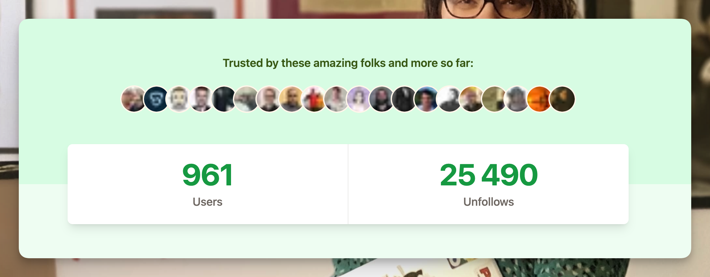
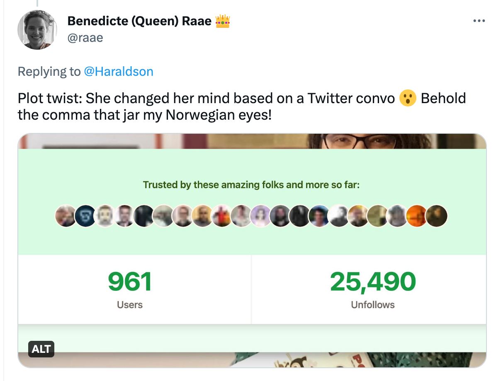

On yesterday's [unauthorized and rum-fueled treasure hunt](https://www.youtube.com/live/HN0nPJ52gUk), we celebrated passing 25000 unfollows facilitated with Prune your Follows!

We did this by attempting to format the number 25000 into something a little more readable. All of the surrounding text is English, so it feels correct to use "en" as the locale:

```js
const number = 25000;
number.toLocaleString("en");
// Result 25,000
```

However, the result did not look good to me, so I did a quick and dirty:

```js
const number = 25000;
number.toLocaleString("en").replace(",", "");
// Result 25 000
```

[](https://pruneyourfollows.com)

But then, after the stream, I got convinced it might just be my sensible Norwegian eyes not handling something so unfamiliar.

[](https://twitter.com/raae/status/1631377391816671232)

**What do you think?**

If you think space, how bad would it be to make it happen by forcing Norwegian formatting using "no" as the locale?

```js
const number = 25000;
number.toLocaleString("no");
// Result 25 000
```

&nbsp;

All the best,\
Queen Raae
