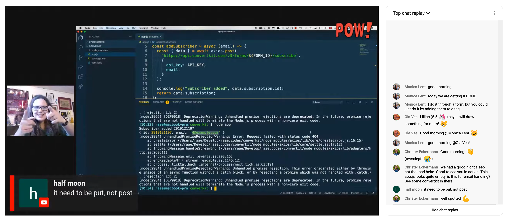

I once spent what felt like an eternity not understanding why updating a ConvertKit subscriber resulted in a 404. Luckily half moon was watching and let me know I needed to use PUT, not POST for this.

Using PUT is technically the correct use of the HTTP methods:

> The difference between POST and PUT is that PUT requests are idempotent. That is, calling the same PUT request multiple times will always produce the same result. In contrast, calling a POST request repeatedly have side effects of creating the same resource multiple times.
>
> <cite>[W3Schools](https://www.w3schools.com/tags/ref_httpmethods.asp)</cite>

But not what my favorite API in the whole wide world, the Stripe API and many others, does. Stripe use POST for both creation and updating.

> POST /v1/customers
> POST /v1/customers/:id
> <cite>[Stripe API Docs](https://www.w3schools.com/tags/ref_httpmethods.asp)</cite>

But once burned, I always double-check, which saved us when using the Outseta API on yesterday's rum-fueled treasure hunt. The Outseta API also uses PUT for updates.

So this is your reminder to double-check that HTTP Method before pursuing other explanations for failing updates.

&nbsp;

All the best,\
Queen Raae
