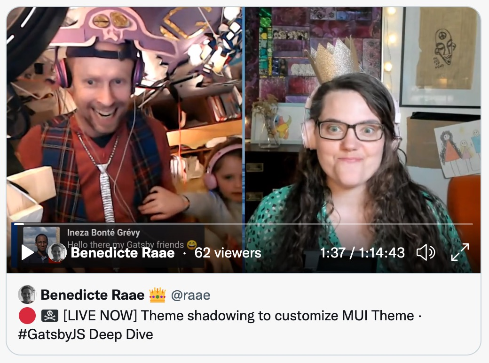

As I mentioned in yesterday's email, we are [standardizing on MUI](/posts/2022-03-10-mui/) as our React UI Library across the board. So, of course, I created a reusable plugin taking care of all the nitty-gritty work of setting MUI up correctly after getting it all to work on queen.raae.codes.

On this week's unauthorized and rum-fueled [treasure hunt](https://youtu.be/kzUUoglO63k) in the sharky waters around the Gatsby islands, the time had come to add MUI to the new POW! marketing site.

[](https://youtu.be/kzUUoglO63k)

Since configuring MUI is a little more complex than what your average plugin options should handle, we are utilizing [Shadowing in Gatsby Themes](https://www.gatsbyjs.com/docs/how-to/plugins-and-themes/shadowing/).

There is no real technical difference between a Gatsby Theme and a Gatsby Plugin, but Gatsby would like us to call plugins that have their own gatsby-config file or are set up for shadowing for themes.

I might just rebel and call them all plugins, but for now, I have stuck to their recommendation and used the theme naming convention: @raae/gatsby-theme-mui.

Back to shadowing...

You may replace any file located in the `src`-folder of a plugin or theme with a file in your root Gatsby project.

Best explained with an example.

For the new POW! marketing site, we added @raae/gatsby-theme-mui to our project.

Then we found the plugin's file structure by taking a peek in our node_modules folder.

```
@raae/
├─ gatsby-theme-mui/
│  ├─ src/
│  │  ├─ ThemeRoot.js
│  │  ├─ config.js
│  │  ├─ getEmotionCache.js
│  │  ├─ theme.js
│  ├─ gatsby-browser.js
│  ├─ gatsby-node.js
│  ├─ gatsby-ssr.js
│  ├─ index.js
│  ├─ package.json
```

We decided to shadow the config.js file. By doing so, we replace the code that gets imported by the @raae/gatsby-theme-mui theme.js file:

```js
// File: @raae/gatsby-theme-mui/src/theme.js

import { createTheme, responsiveFontSizes } from "@mui/material/styles";
import config from "./config";

let theme = createTheme(config);
responsiveFontSizes(theme);

export default theme;
```

Shadowing is achieved by adding a new config.js file to our Gatsby project at a particular location:

```
pow-site/
├─ src/
│  ├─ @raae/
│  │  ├─ gatsby-theme-mui/
│  │  │  ├─ config.js
│  ├─ pages/
│  ├─ templates/
│  ├─ ...more
├─ gatsby-node.js
├─ package.json
```

```js
// File: pow-site/src/@raae/gatsby-theme-mui/config.js

import { red } from "@mui/material/colors";

const config = {
  palette: {
    primary: {
      main: red.A700,
    },
  },
};

export default config;
```

And voila, we have changed the primary color to a POW! red.

Check out the [pow-site repository](https://github.com/olavea/pow-site/blob/main/src/%40raae/gatsby-theme-mui/config.js) on GitHub for more detail, and take a look at Gatsby's official [Shadowing in Gatsby Themes](https://www.gatsbyjs.com/docs/how-to/plugins-and-themes/shadowing/) article.

&nbsp;  
All the best,  
Queen Raae
