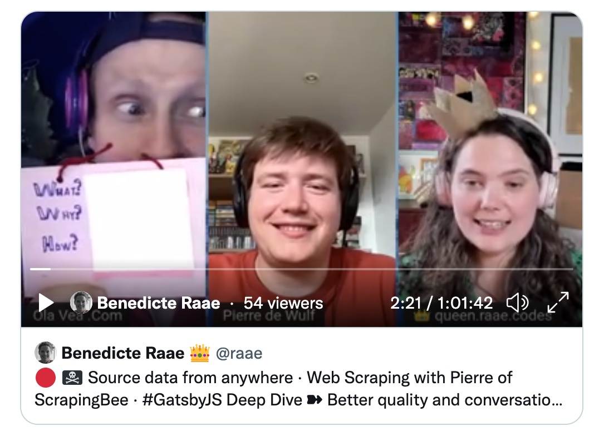

[Pierre de Wulf](https://twitter.com/PierreDeWulf), co-founder of [ScrapingBee](https://www.scrapingbee.com/) joined us on yesterday's [unauthorized and rum-fueled treasure hunt](https://youtu.be/MjcYzjYIFuI) in the sharky waters around the Gatsby islands.

[](https://youtu.be/MjcYzjYIFuI)

## The What?

Source Crowdcast webinars into the Gatsby Data Layer using ScrapingBee — an API that simplifies web scraping.

## The Why?

There is no official Crowdcast API and keeping the data in sync using copy/past is a pain (or at least boring 🤪). To scrape from Crowdcast, we need to load the page in a headless browser such as Puppeteer. Doing so is not possible as part of the Gatsby build process, so we outsource it to ScrapingBee.

## The How

We used the [Data Extraction](https://www.scrapingbee.com/features/data-extraction/)-feature from ScrapingBee. It lets us select data on a page using CSS-selector. It felt kinda similar to [cheerio](https://cheerio.js.org/) if you have ever used that.

As always, I started with copy/pasting the [example snippets](https://www.scrapingbee.com/documentation/data-extraction/). It worked almost out of the box, but we had to make use of the `wait_for` option as the Crowdcast page takes a while to load:

> It's sometimes necessary to wait for a particular element to appear in the DOM before ScrapingBee returns the HTML content.
> <cite>[ScrapingBee Docs](https://www.scrapingbee.com/documentation/#wait_for)</cite>

## The Code

```js
const axios = require("axios");

const scrapeCrowdcast = async () => {
  const { data } = await axios.get("https://app.scrapingbee.com/api/v1", {
    params: {
      api_key: process.env.SCRAPING_BEE_API_KEY,
      url: "https://www.crowdcast.io/raae",
      // Wait for there to be at least one
      // non-empty .event-tile element
      wait_for: ".event-tile",
      extract_rules: {
        webinars: {
          // Lets create a list with data
          // extracted from the .event-tile element
          selector: ".event-tile",
          type: "list",
          // Each object in the list should
          output: {
            // have a title lifted from
            // the .event-tile__title element
            title: ".event-tile__title",
            // and a path lifted from
            // the href attribute of the first link element
            path: {
              selector: "a",
              output: "@href",
            },
          },
        },
      },
    },
  });

  return data;
};
```

The resulting data object:

```js
{
  webinars: [
    {
      title: "5 Gatsby Gotchas to look out for as a React developer",
      path: "/e/gatsby-gotchas-react?utm_source=profile&utm_medium=profile_web&utm_campaign=profile",
    },
    {
      title: "Testing your Gatsby Serverless Functions",
      path: "/e/testing-your-functions?utm_source=profile&utm_medium=profile_web&utm_campaign=profile",
    },
    // and more
  ];
}
```

We then loop through the webinars on the data object creating content nodes:

```js
// gatsby-node.js
exports.sourceNodes = async (gatsbyUtils) => {
  const { actions, createNodeId, createContentDigest } = gatsbyUtils;
  const { createNode } = actions;

  const data = await scrapeCrowdcast();

  for (const webinar of data.webinars) {
    createNode({
      id: createNodeId(webinar.path),
      title: webinar.title,
      url: "https://www.crowdcast.io" + webinar.path,
      rawScrape: webinar,
      internal: {
        type: `CrowdcastWebinar`,
        mediaType: `text/json`,
        content: JSON.stringify(webinar),
        contentDigest: createContentDigest(webinar),
      },
    });
  }
};
```

And voila, we have webinar nodes in our data layer:

```graphql
query MyQuery {
  allCrowdcastWebinar {
    nodes {
      title
      url
    }
  }
}
```

To see the entire demo, check out its [GitHub repository](https://github.com/queen-raae/gatsby-demo-web-scraping/blob/main/gatsby-node.js).

&nbsp;  
Should we make this a full-featured plugin? Extracting the cover art and descriptions from the individual webinar pages? Let me know!

&nbsp;  
All the best,  
Queen Raae

&nbsp;  
**PS:** ScrapingBee is a paid service, but we are as always neither sponsored nor an affiliate.  
**PPS:** If you want to learn more about web-scraping without ScrapingBee check out their article [Web Scraping with Javascript and NodeJS](https://www.scrapingbee.com/blog/web-scraping-javascript/).
