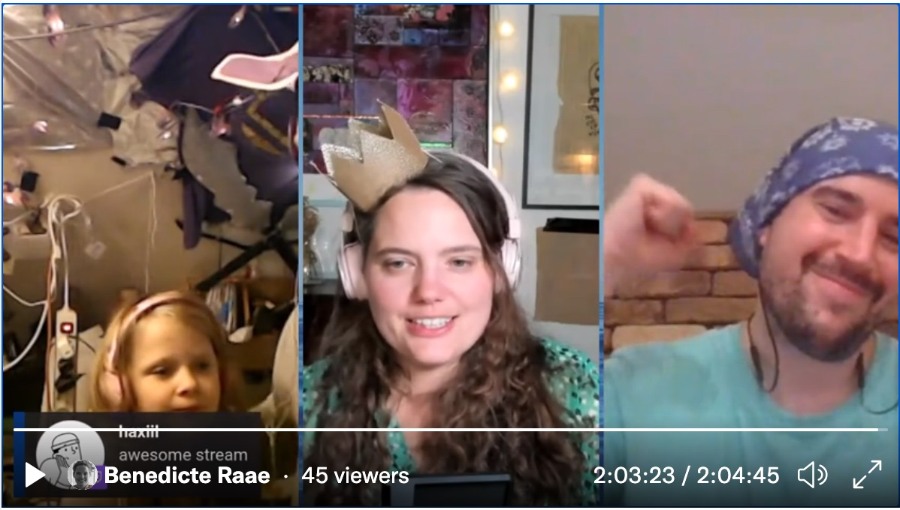

Friday's guest [Tayler (@borderless_dev)](https://twitter.com/borderless_dev) on the [unauthorized and rum-fueled treasure hunt](https://youtu.be/nNn3bAx5l9E) in the sharky waters around the Gatsby islands is our most piratical guest to date 🏴‍☠️

[](https://youtu.be/nNn3bAx5l9E)

> Distribute Aid's mission is to provide for basic human needs at scale by connecting communities and empowering people to uphold human dignity.

It ended up being a long one as we completed the refactoring for all the page templates, including some extra work needed for the third one. However, we completed the first migration within the first 30 minutes of the stream if you want to watch how!

## The What?

Migrate [Distribute Aid](https://distributeaid.org/)'s Gatsby site from a page context to page query approach for getting data into their page templates.

## The Why?

Pushing all data needed by a page through the page context works and is a straightforward solution I see many developers reach for. However, you then bypass Gatsby goodness, such as hot reloading and incremental builds, by removing the connection between a node and its page.

## The How

Instead of pushing through all data on the page context, pass only the node id. Then in the page template, use the node id to query for all data needed.

## The Code

Before migration: pushing all data on the page context:

```js
// File: gatsby-node.js
const path = require("path");

exports.createPages = async (gatsbyUtils) => {
  const { graphql, actions } = gatsbyUtils;
  const { createPage } = actions;

  const regionsQuery = await graphql(
    `
      query RegionsQuery {
        regions: allDaRegion {
          nodes {
            slug
            name
            overview
            subregions {
              name
            }
          }
        }
      }
    `
  );

  regionsQuery.data.regions.nodes.forEach((region) => {
    createPage({
      path: `/regions/${region.slug}`,
      component: path.resolve(`./src/templates/RegionPage.js`),
      context: {
        region: region,
      },
    });
  });
};
```

```js
// File: src/templates/RegionPage.js
import { graphql } from "gatsby";

const RegionPage = ({ pageContext: { region } }) => {
  return <main>{JSON.stringify(region, null, 2)}</main>;
};

export default RegionPage;
```

After migration, passing only the node id:

```js
// File: gatsby-node.js
const path = require("path");

exports.createPages = async (gatsbyUtils) => {
  const { graphql, actions } = gatsbyUtils;
  const { createPage } = actions;

  const regionsQuery = await graphql(`
    query RegionsQuery {
      regions: allDaRegion {
        nodes {
          id
          slug
        }
      }
    }
  `);

  regionsQuery.data.regions.nodes.forEach((region) => {
    createPage({
      path: `/regions/${region.slug}`,
      component: path.resolve(`./src/templates/RegionPage.js`),
      context: {
        id: region.id,
      },
    });
  });
};
```

```js
// File: src/templates/RegionPage.js
import { graphql } from "gatsby";

const RegionPage = ({ data: { region } }) => {
  return <main>{JSON.stringify(region, null, 2)}</main>;
};

export default RegionPage;

export const query = graphql`
  query ($id: String!) {
    region: daRegion(id: { eq: $id }) {
      name
      overview
      subregions {
        name
      }
    }
  }
`;
```

&nbsp;

Check out the [Pull Request on Github](https://github.com/) to view the full refactor, as the example above is somewhat simplified.

&nbsp;

All the best,  
Queen Raae

&nbsp;

**PS:** The [Distribute Aid project](https://github.com/distributeaid/distributeaid.org) is a great one to contribute to if you would like to help out or need more real-world Gatsby experience.
